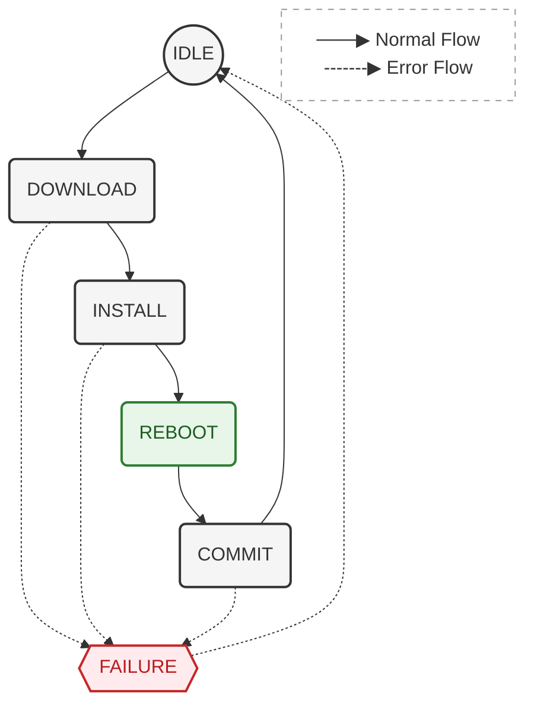

# Aegis OTA State Machine

This document explains the OTA state-machine flow used by the target daemon.

Use this guide when you want to understand:

- which states exist
- what each state is responsible for
- when the daemon transitions to success or failure paths

For Yocto-side bundle generation, see [build.md](build.md).
For target runtime, DBus, and CLI behavior, see [target.md](target.md).
For the bundle install pipeline, see [overview.md](overview.md).

## State Descriptions

## Idle

`Idle` is the normal waiting state of the daemon.

In this state, the daemon keeps the device OTA status synchronized with GCS and waits for an update request.  
An update can be triggered by GCS or by the local CLI through DBus.

Typical responsibilities:

- report current OTA status to GCS
- report current device/software version
- listen for install requests from DBus CLI
- wait for a valid update command from GCS
- keep the daemon ready for the next OTA flow

When a valid update request is received, the daemon moves to `Download`.

> TODO: the flow between GCS and device are not implemented, currently just support cli request

## Download

`Download` prepares the OTA bundle for installation.

If the update source is remote, the daemon downloads the `.swu` bundle into the configured data directory.  
If the bundle is already available locally, the daemon validates that the file can be accessed and used.

TODO: Before continuing, the daemon should also check whether the flight controller state allows OTA update.

The daemon moves to `Install` only when the bundle is ready.

Failure conditions:

- bundle download fails
- bundle file is missing or incomplete
- bundle appears corrupted or tampered with
- target device is not allowed to update
- flight controller state does not allow OTA update

If any of these checks fail, the daemon moves to `Failure`.

## Install

`Install` verifies and applies the OTA bundle to the inactive slot.

In this state, the daemon verifies the signed `sw-description`, checks payload hashes, decrypts encrypted payloads when required, and streams the payload data directly to the proper installer handler.

Aegis does not unpack the whole `.swu` bundle before installing.  
Payloads are processed while reading the bundle stream.

Typical responsibilities:

- verify `sw-description.sig` with the configured public key
- parse the manifest for the selected target slot
- choose the inactive slot as the update target
- verify payload SHA-256 values
- decrypt encrypted payloads
- stream payloads to the target partition or filesystem
- update slot status
- set the updated slot as the next boot target
- persist OTA state before reboot

Failure conditions:

- manifest signature verification fails
- payload hash verification fails
- payload decryption fails
- payload installation fails
- boot slot update fails
- OTA state cannot be saved
- TODO: flight controller state becomes unsafe for update

If installation succeeds, the daemon moves to `Reboot`.  
If any step fails, the daemon moves to `Failure`.

## Reboot

`Reboot` restarts the system so the device can boot into the updated slot.

Before rebooting, the daemon has already saved enough OTA state to allow the next boot to determine whether the update should be committed or rolled back.

Typical responsibilities:

- make sure the new slot is selected as the next boot target
- save pending OTA state
- request system reboot

After the system boots again, the daemon resumes the OTA flow and moves to `Commit`.

## Commit

`Commit` validates the result of the update after reboot.

In this state, the daemon checks whether the device actually booted from the expected updated slot.  
If the booted slot is correct, the update is considered successful and the slot is committed as valid.

Typical responsibilities:

- restore pending OTA state
- read the currently booted slot
- compare booted slot with the expected updated slot
- mark the update as successful
- report success to GCS
- clear pending OTA state

If validation succeeds, the daemon returns to `Idle`.

Failure conditions:

- device booted from the wrong slot
- updated slot is not valid

If validation fails, the daemon moves to `Failure`.

## Failure

`Failure` is the terminal error-handling state for an OTA attempt.

In this state, the daemon stops the current OTA flow, records the error, updates its status, and reports the failure to GCS.

Typical responsibilities:

- stop the active OTA operation
- record the failure reason
- update daemon status
- report OTA failure to GCS
- keep the system in a safe state
- return to `Idle` when the failure has been handled

After the failure is handled, the daemon returns to `Idle` and waits for the next update request.
